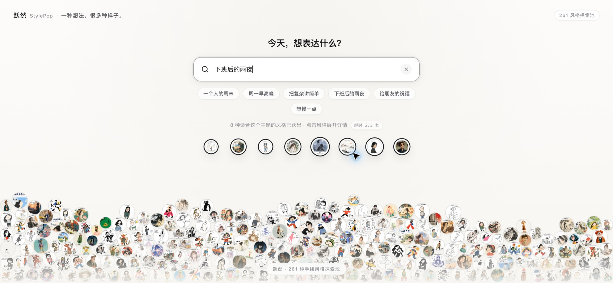
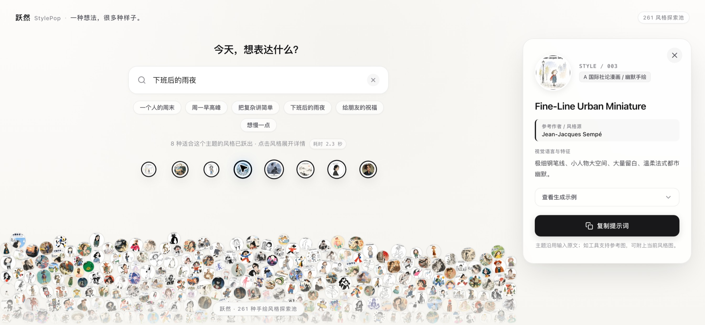
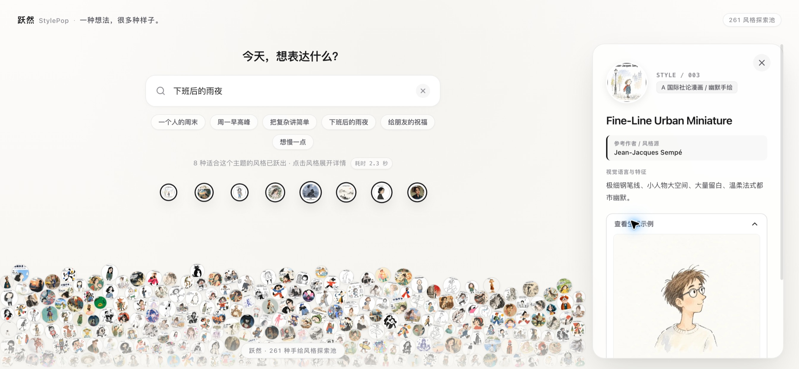
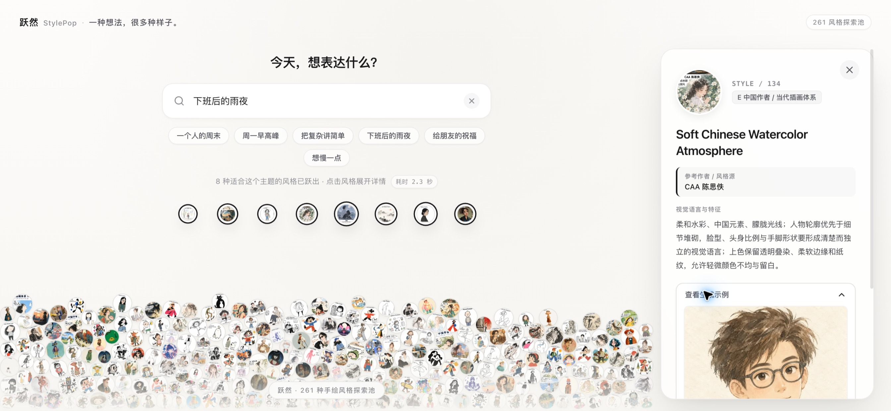

# 跃然 StylePop

跃然 StylePop 是一个本地运行的手绘风格探索工具。输入一个主题后，工具请 TypeSafe 的 Jev 按风格文字资料筛选候选；你可以查看风格参考图、示例图片，并复制一份用于图像生成工具的提示词。

它根据文字资料匹配，不会把图片发送给 Jev，也不判断结果是否一定适合你的主题。候选是探索建议，不是经过统计验证的推荐结论。

## 界面截图

以下是本地服务真实运行时截取的页面画面，覆盖风格池、实时搜索、详情和示例。图片已重新编码并移除 EXIF、ICC 等元数据；截图不含浏览器地址栏或本地文件路径。










## 功能

- 输入主题后自动筛选；停止输入约 600 毫秒后发起请求，按 Enter 可立即提交。
- 展示 5–8 个候选风格及其本地图片资料。
- 复制提示词；复制动作不会上传图片或联系图像生成服务。
- 在本机内存中缓存结果，重启服务后服务端缓存清空。

## 环境要求

- Node.js 18 或更高版本；建议使用仍在维护的 Node.js LTS 版本。服务端使用 Node.js 自带的 `fetch` 和 `AbortSignal.timeout`，项目没有第三方 npm 运行依赖。
- 仓库已附带 261 条风格资料和 522 张 WebP 图片，无需另行准备本地素材即可完整体验。

## 风格资料与图片

默认资料放在 `data/`，结构如下：

```text
data/
├── styles.json
└── assets/
    ├── previews/
    └── avatars/
```

`data/styles.json` 顶层有 `styles` 数组，包含 261 条记录。每条记录至少有这些字段：

- `id`、`name`、`author`、`group`、`traits`
- `preview_url`、`avatar_url`：相对于 `data/` 的图片路径，例如 `assets/previews/001.webp`

图片路径指向 `data/assets/` 下的文件。若要替换或补充资料，请只使用你有权使用和分发的内容，并遵循相同的数据结构。

本仓库随代码一起提供 261 条风格记录和 522 张 WebP 图片：其中 261 张风格参考图取自原 [handraw-style Skill 仓库](https://github.com/yang0/handraw-style) 的 001–261 子集；另 261 张头像图片是以作者个人 IP 头像制作的风格迁移示例，已获准在本仓库公开展示和下载，仅供参考。

上游对部分素材的来源和知识产权范围说明可能不完整，且上游内容或许可信息可能发生变化。项目保留了上游来源链接、许可文本和素材说明，但未据此独立核实每张素材的完整权利链。请阅读 [`THIRD_PARTY_NOTICES.md`](THIRD_PARTY_NOTICES.md)：本项目仅供学习与交流，不保证素材不存在第三方权利主张，也不授予第三方素材的商业使用权。使用者应自行核实著作权、商标权、肖像权等风险；如计划商用，应自行评估并取得所需授权。项目作者不对上游变更、知识产权争议或使用者的相关使用风险承担责任，具体范围以第三方说明及适用法律为准。

服务端通过 JSON 解析资料，不会执行数据文件中的 JavaScript。网页只会收到界面需要的风格字段，不会收到完整 JSON 中其他字段。

## 配置 TypeSafe API Key

请到 [TypeSafe 官方控制台](https://console.typesafe.ai/login) 注册或登录，并按照控制台当前流程为自己的账号获取 API Key。API 的认证方式和请求格式见 [TypeSafe API 文档](https://api.typesafe.ai/docs)。账号可用性、用量限制和收费以 TypeSafe 当前规则为准。

在启动服务的同一个终端会话中设置 `TYPESAFE_API_KEY`。下面会在终端提示时读取 Key，不会把它写进命令历史：

```bash
# macOS / Linux
printf 'TypeSafe API key: '
read -s TYPESAFE_API_KEY
export TYPESAFE_API_KEY
printf '\n'
npm start
```

```powershell
# Windows PowerShell
$env:TYPESAFE_API_KEY = Read-Host "TypeSafe API key"
npm start
```

本项目不读取 `.env` 文件。不要把真实 Key 写入源码、README、截图或提交记录；`.gitignore` 会排除 `.env` 文件，但仍应在提交前检查 Git 暂存区。

## 启动

从项目根目录运行：

```bash
npm start
```

然后在浏览器打开 <http://127.0.0.1:5175>。默认端口是 `5175`；若端口已被占用，可在启动前设置 `PORT` 环境变量。

健康状态页面是 <http://127.0.0.1:5175/api/health>。它会显示资料条目数和 Key 是否已配置，不会返回 Key 本身。

## 数据如何流动

- 浏览器把主题发给本机 Node.js 服务。
- 对于未缓存的主题，服务端会向 `https://api.typesafe.ai/v1/systemone` 并行发送 5 个请求。每个请求包含该主题，以及最多 60 条风格的文字资料（编号、名称、作者、分组和视觉特征）。图片文件和 API Key 不会放进请求正文；Key 由服务端放入认证请求头。
- 主题会离开你的电脑并交给 TypeSafe API 处理。请先阅读 [TypeSafe 隐私政策](https://typesafe.ai/legal/privacy-policy) 和服务条款；不要输入个人信息、保密内容或其他不适合交给第三方处理的主题。
- 结果和主题会暂存在服务端内存（最多 50 个不同主题）；网页运行期间也会在浏览器内存中缓存最多 30 个主题。它们不会由本项目写入磁盘，关闭或重启后相应缓存会消失。
- 清空或改写输入会中止浏览器请求，但已经发往 TypeSafe 的调用不保证停止处理或停止计费。

服务只绑定到本机回环地址，没有账号验证、访问控制或面向公网的防护。不要把它暴露到局域网或公网。若要部署为多人使用的服务，需要先设计认证、滥用防护、配额和数据保留策略。

## 项目许可

本仓库原创代码和项目文档按根目录 [`LICENSE`](LICENSE) 中的 MIT 许可证提供。MIT 许可不覆盖或扩大第三方风格资料、参考图和头像示例的权利范围；这些素材的来源、限制与风险说明见 [`THIRD_PARTY_NOTICES.md`](THIRD_PARTY_NOTICES.md)。
